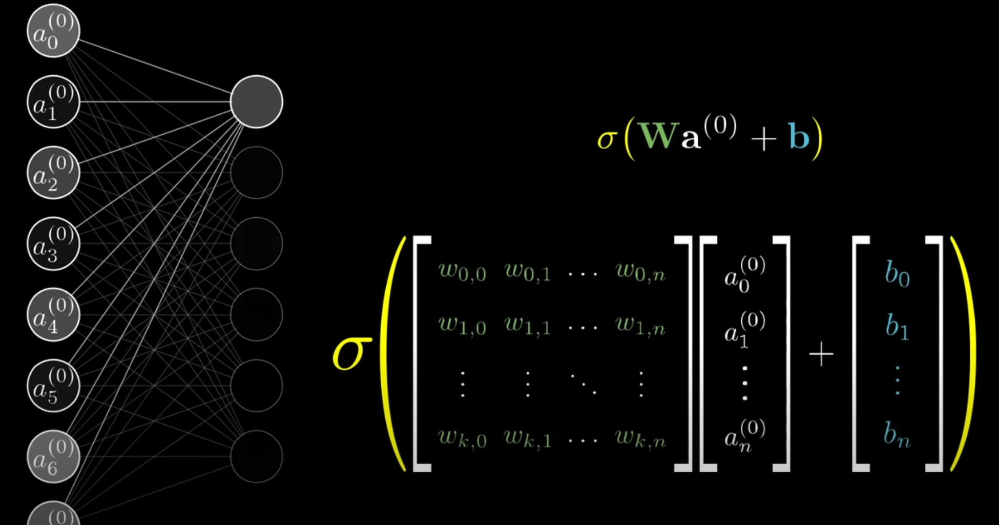

## nn to transformers from scratch.

Take a matrix of [n x m]. 

Say n=24, m=24.

The inputs will be [728,1] vector.

The outputs are determined by your application, usually a single node for regressors or node per class label. 

Say you want to predict 10 digits (0-9), then outputs are a [10,1] vector.

Hidden layers are user defined, they are composed of n nodes each. 

There's no scientific method applied to the config of hidden layers, the base case which works well 1 hidden layer with the mean of number of input and output nodes.

There are techniques to optimize this.

So far: input, hidden and output layers, each with shape [n,1]. 

---

### How it operates?

Loosely, the activation (values of nodes) of one layer will affect the next layer.  

In the second-to-last layer the node would fire if it has picked up a pattern that uniquely identifies your category. 

So when you pass an input where all and nn fires for specific pattern set, it will sort of reconstruct your category. Weird, but that's the intuition.

### Mechanism

You want a mechanism for patterns in the input layers to be highlighted in the next layer and then the next layer and so forth.

You want to mapping from the inputs an encoded pattern to next layer.

You want to process the inputs such that they express these patterns in the next node.

This is done by assigning a weight between each input node and the next layer nodes.

As you move from the inputs towards the hidden layers, the network is contructing patterns based on what is activated.

Take all inputs and one node of the second hidden layer: 
- For each hidden layer node, you will have as many paramaters (weights) as there are inputs.
- It's a many-to-one relationship. Every input is connected to the next node, ie. you will have 728 connections/weights for every node. 
- Then take each activation (the values) in the input layer and multiply with each weight.
- For every node in the second layer you will have 728 activations (inputs) X 728 unique weights.
- This is cool, this means that for every node in the second layer, you have the same [24,24] weights for each node in the next layer. Plotting how they look like would be nice!
- Imagine the node in second layer represent a region. If you make all the weights not in that region to be zero, then you would isolate for region of interest. When you do the activation time weights (ie. weighted sum) for this region, the higher the value, the more signal that a pattern exists there.
- On every node, you want to reduce the values to [0,1]. So you transform the weigthed-sum by a function that does this. First they used Sigmoid, which basically says that for a large negative number you get 0 and a large positive you get 1. The activation value becomes this transform, which is how positive the weigthed sum is.
- Now you don't want to have a bias for signal, meaning, a little activated is not useful enough to capture patterns. You want a lot of signal. You let's say that you want activation only if weighted-sum is actually large, say >10. This is called BIAS FOR INACTIVITY because you are artificially downgrading a low activation (eg. your activation is not high enough bro).
- This BIAS FOR INACTIVITY is a term you add to the weighted-sum before the transform. Effectively, the bias is a measure of how much does the weighted-sum needs to be before it's meaningfully active.

Now let's generalize:
- Assume the second layer has 16 nodes.
- You will have 784 X 16 connections.
- Every node in the second layer has it's OWN BIAS value.
- Every node in the second layer will have an activation value of activation_function(weigthed-sum + BIAS).
- Our network has 10 output nodes. Each will also have it's own BIAS.

Let's see:
- This network architecture is composed of 3 layers, the inputs, one hidden layer and the outputs.
- The shapes are [728,1], [16,1], and [10,1].
- In the first two layers there are 728 X 16 weights, 16 biases and 16 operations of activation_function(weighted_sum(728 weights X 728 inputs)+BIAS).
- Between second layer and output there are 16 X 10 weights, 10 additional biases from outputs, and again 10 operations act_func(wsum(16X10)+BIAS).
- In total 728 X 16 + 16 X 10 = 11,808 weights, and, 16 + 10 = 26 biases.
- That is 11,834 parameters to tweak to make this nn behave differently.

### Learning

Learning is to find the right values for all these 11,834 parameters.

### Compact Notation

Take the inputs and one node from the second layer:

You can represent the inputs as vector of shape [728, 1].
Then all of the weights as [1,728].

Generalized to all the nodes in the second layer (16), then this matrix will have shape [16,728].

Imagine a little nn with 5 and 1 nodes in hidden layer.

Inputs:
[i0]  
[i1]  
[i2]  
[i3]  
[i4]  

Nodes in hidden layer:
[(w0,0),(w0,1),(w0,2),(w0,3),(w0,4)]

Each row of this matrix corresponds to the weights or connections between all inputs and one node.

You can take the dot product of these two now and that will be the weighted sum. Simple linear algebra!

In this chart below, when you do the dot product, each term of the output vector [n,1] is the product-sum of one row of weights times all the inputs vector. Using the example, one element of the result matrix is the sum of multiplying 728 inputs X its weight which is of shape [nodes in second layer, 1].

You can also represent the bias values as another vector of shape [nodes in second layer, 1], so one bias per node, and sum them easily.

### How do they learn?

